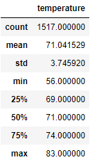

# Comparing Weather in June and December for a Surf Shop

## Overview of Project
The overall purpose of this project was to analyze and compare data in the months of June and December over several years in Oahu to 
determine if the surf and ice cream shop is sustainable all year. We extracted data from the hawaii.sqlite file and then filtered
on the months of June and December. We then converted it into data frames and calculated the summary statistics.

## Results
Here are the summary statistics we produced:
### June

### December

* The mean for the month of June is almost four degrees higher than the month of December which is not suprising considering Hawaii
is in the northern hemisphere.
* The median is also several degrees higher which tells us that the weather is consistently a couple degrees higher on average in June than
December. 
* The standard deviation is slightly higher in December which means the temperature is much more variation.

## Summary

### First Recommendation
One recommendation I have is to run a query comparing not only temperature, but precipitation along with the temperature. This would be 
a worthwhile analysis because even if it is warm outside, nobody wants to go surfing if it is pouring rain. This would give us a more clear
understanding of the differences between June and December and whether or not it would be wise to keep the shop open year round.

### Second Recommendation
Lastly, another query I would run is to see if there were any outlier years that would affect the summary statistics. This would accomplish
two things in my opinion. One, it would tell you that if there was just one really cold December one year, it might make the mean temperature
seem lower than it should be. Two, if there are a lot of outlier December months, maybe that would tell us that it is too risky to keep the
shop open year round.
